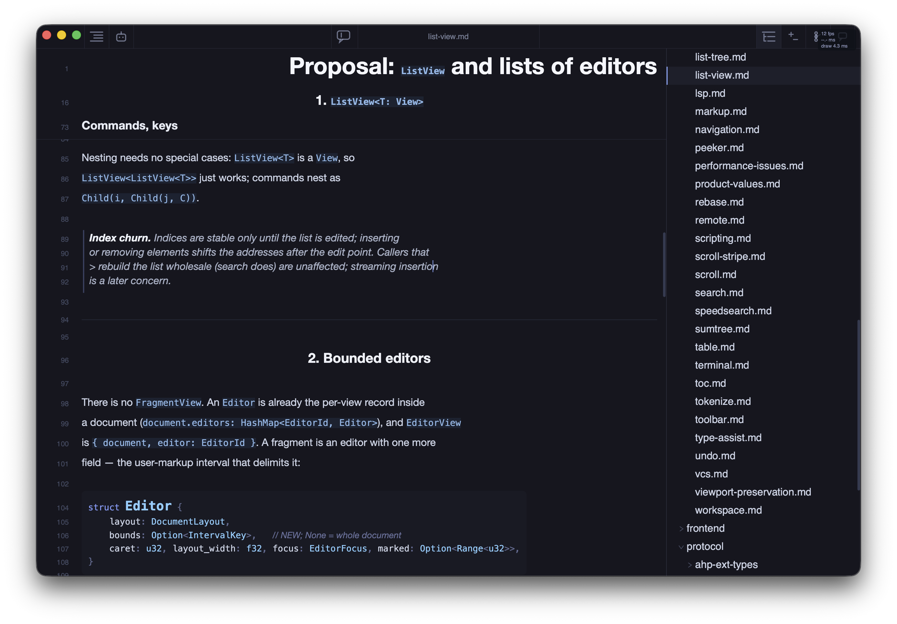
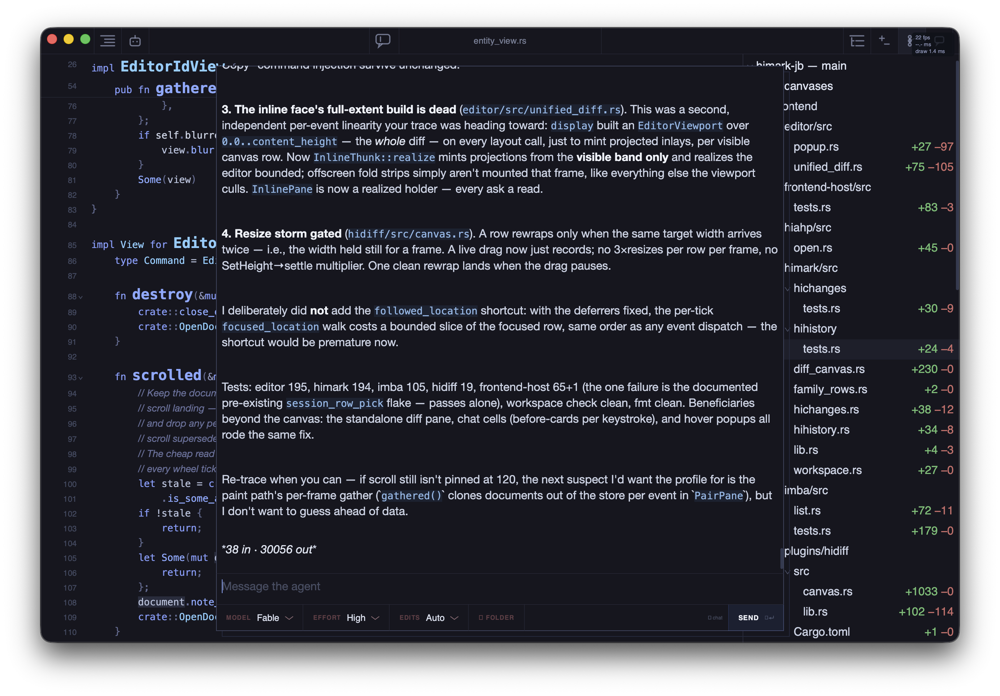
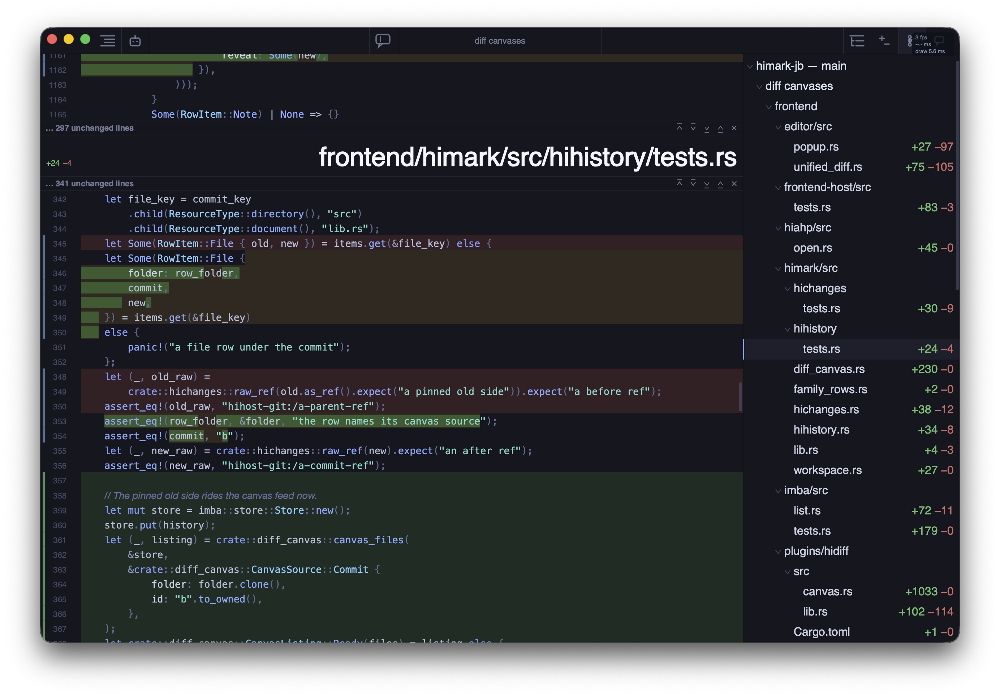
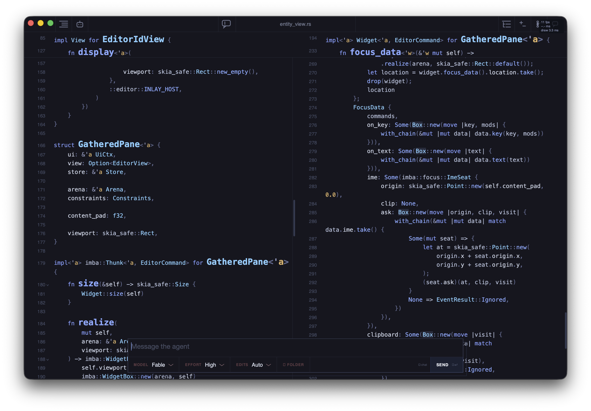
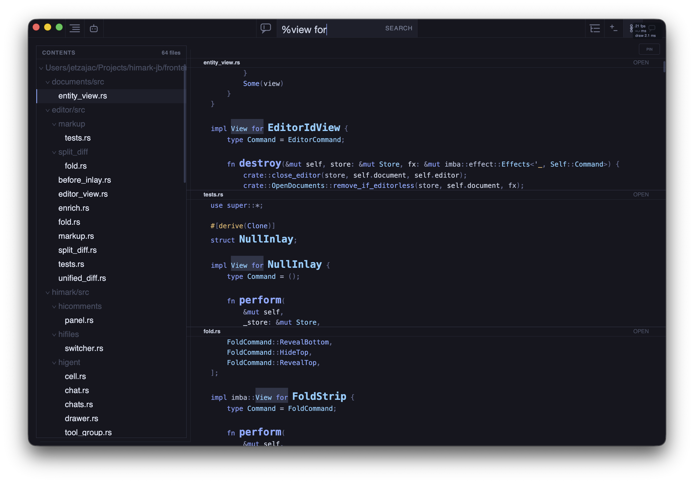
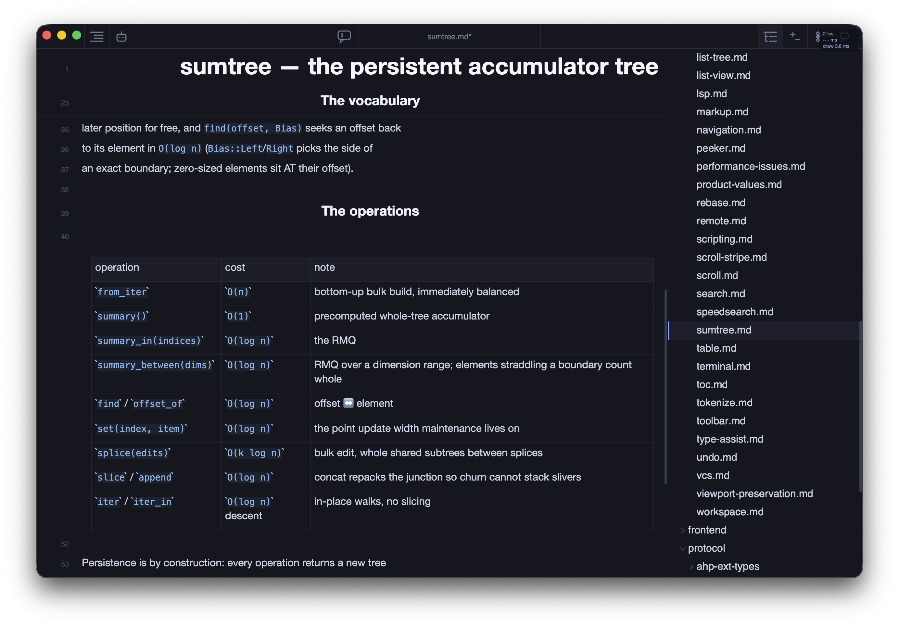

# himark

[](https://confluence.jetbrains.com/display/ALL/JetBrains+on+GitHub) 

himark is an experimental markdown editor and AHP client written in Rust. The app core is a
headless engine that renders through [Skia](https://skia.org) and is embedded
into a native shell on each platform: an AppKit/UIKit app on macOS and iOS, a
`winit` window on Linux and Windows, and a WebAssembly build in the browser.
A separate backend process, the **agent host**, owns everything that touches
the outside world: files, search, terminals, language servers, git, and
coding agents (Claude Code and Codex).

<p align="center">
  
  
</p>
<p align="center">
  
  
</p>
<p align="center">
  
  
</p>

## Repository layout

```
frontend/         the engine: rope, text, intervals, layout, editor, plugins,
                  and the shells' Rust halves (frontend-host, desktop, himark-winit)
frontend/plugins/ feature plugins (markdown, search, palette, peeker, diff, code)
frontend/plugins/lang/  one tree-sitter language plugin per folder
backend/          the agent host (himark-agent-host) and its services
protocol/         serde types shared by both sides, plus host discovery
apps/             platform shells: himark-apple (macOS + iOS), linux, windows, web
vendor/           patched skia-bindings and tree-sitter crates
```

## Documentation

The design docs are the map of the codebase; start here:

- [Design.md](docs/Design.md) — what himark is and the shape of the
  whole: the product, the engine, the host.
- [docs/ui/UI.md](docs/ui/UI.md) — the immediate-mode UI framework
  (`imba`), root of the UI family.
- [docs/editor/document.md](docs/editor/document.md) — the `Document`
  value, root of the editor family: text, markup, layout, diffs, and
  why they are one value.
- [docs/ahp/host.md](docs/ahp/host.md) — the agent host and the AHP
  protocol features.

## Building

See [CONTRIBUTING.md](CONTRIBUTING.md) for prerequisites, per-platform
build instructions, the agent host, releases, and troubleshooting.

## Keyboard shortcuts

The default keymap lives in `frontend/himark/assets/keymap.json`. `cmd` is
the Command key on macOS and Control on Linux and Windows.

| Shortcut | Action |
|---|---|
| `cmd-n` | New document |
| `cmd-o` | Open (macOS app) |
| `cmd-s` | Save |
| `cmd-w` / `cmd-shift-w` | Close document / close pane |
| `cmd-shift-d` | Split pane |
| `cmd-p` | Peeker (file switcher) |
| `cmd-shift-p` | Command palette |
| `cmd-f`, `cmd-g`, `cmd-shift-g` | Find, next, previous |
| `cmd-shift-f` | Search in files |
| `cmd-t` | Table of contents |
| `cmd-e` | Files tree |
| `cmd-i` | Chat composer |
| `cmd-r` | Changes view |
| `cmd-shift-c` | Comments view |
| `cmd-shift-u` | Switch session |
| `cmd-[` / `cmd-]` | Navigate back / forward |
| `cmd-d` / `cmd-shift-l` | Select next / all occurrences |
| `cmd-alt-up` / `cmd-alt-down` | Add caret above / below |
| `alt-z` | Toggle soft wrap |
| `ctrl-space` | Trigger completion |
| `cmd-enter` | Open in full |

## Environment variables

| Variable | Effect |
|---|---|
| `HIMARK_AGENT_HOST_BIN` | Path of the host binary a shell should autostart |
| `HIMARK_HOST_HOME` | Directory for the host lockfile and socket (default `~/.himark/agent-host`) |
| `HIMARK_HOST_AUTOSTART` | `1` or a binary path: lets the AHP client itself spawn a host when discovery finds none |
| `HIMARK_AHP_URL` | Connect to an agent host at this URL instead of discovering one |
| `HIMARK_WEB_ROOT` | Directory the host serves as the web app |
| `HIMARK_HTTP_BIND` | Bind address for `debug-web.sh` (default `127.0.0.1:4312`) |
| `HIMARK_CLAUDE_BIN`, `HIMARK_CODEX_BIN`, `HIMARK_RUST_ANALYZER` | Pin the external tools |
| `HIMARK_LOG_DIR` | Log directory (default `~/Library/Logs/Himark`) |
| `HIHOST_TRACE` | Mirror host logs to stderr |
| `RUST_LOG` | Log filter for host and app logs |

## Troubleshooting

- **"no himark agent host running"**: the shell could not find or start the
  backend. Build it with `cargo build -p agent-host` so it sits next to the
  shell binary, or start it by hand and try again.
- **"a live host from another build holds ~/.himark/agent-host"**: a host
  from an older build was running; the shell replaces it automatically. If a
  stale lockfile blocks startup, stop the old process and delete
  `~/.himark/agent-host/host.lock`.
- **Skia download fails**: the first build needs access to GitHub releases.
  Set `SKIA_LIBRARY_SEARCH_PATH` to a directory with prebuilt Skia libraries
  to build offline, or `FORCE_SKIA_BUILD=1` to compile Skia from source.
- **Linker errors mentioning `__std_min_f` on Windows**: update the MSVC
  toolset to 14.40 or newer.
- **iOS build fails in `bindgen` with `stdio.h not found`**: run through
  `build.sh`, which sets the SDK sysroots, rather than invoking cargo directly.
- **Web build cannot find `emcc`**: set `EMSDK` to your emsdk checkout, or
  install Emscripten with Homebrew.

## License

himark is licensed under the Apache License 2.0. See [LICENSE](LICENSE).
