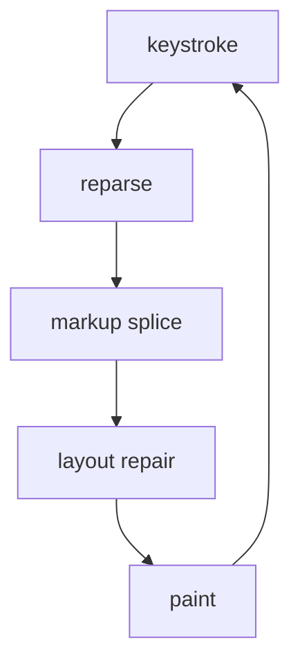

# Himark Render Torture Sample 🚀

This file is intentionally more varied than the design notes. It mixes ordinary prose, emoji, inline `code`, **strong text**, _emphasis_, ~~deleted text~~, [links](https://example.com), and long lines that should soft-wrap cleanly without making the renderer work harder than necessary.

## Inline Texture

The quick brown fox edits markdown at 120 Hz while the cursor passes through Unicode: café, résumé, naïve, Ελληνικά, Русский, 日本語, 한국어, العربية, हिन्दी, and emoji clusters like 👩‍💻, 🧑🏽‍🚀, 🏳️‍🌈, ❤️‍🔥, and family glyphs 👨‍👩‍👧‍👦.

- [x] Parse a tree-sitter tree
- [x] Build document elements
- [ ] Paint real inline spans
- [ ] Stop pretending a paragraph is a visual line
- [ ] Keep scrolling boringly fast

> A quote should look like a quote eventually. For now it is useful because it exercises punctuation, wrapping, and multiple inline styles inside a blockquote with **bold claims**, _quiet caveats_, and `tiny identifiers`.

### Code Fence: Rust

```rust
use std::time::{Duration, Instant};

fn render_frame(viewport_y: f32, visible_height: f32) -> Duration {
    let started = Instant::now();
    let bottom = viewport_y + visible_height;
    println!("painting visible range: {viewport_y:.1}..{bottom:.1}");
    started.elapsed()
}
```

### Code Fence: JavaScript

```javascript
const rows = ["heading", "paragraph", "list item", "code block"];
for (const [index, row] of rows.entries()) {
  console.log(`${index}: ${row} ✅`);
}
```

### Code Fence: JSON

```json
{
  "renderer": "skia paragraph",
  "targetFrameMs": 8.33,
  "documentBytes": "about 100k after repetition",
  "emoji": ["🚀", "🧪", "📜", "🧵"]
}
```

### Code Fence: Mermaid



## Lists And Tables

1. First ordered item with enough text to wrap over several visual lines on narrower windows.
2. Second ordered item with `inline_code()` and **bold** and _italic_ content.
3. Third ordered item with a link: [tree-sitter markdown](https://tree-sitter.github.io/tree-sitter/).

| Feature | Stressor | Notes |
| --- | --- | --- |
| Unicode | emoji and combining marks | width, shaping, fallback fonts |
| Code | monospace fences | background plus paragraphs |
| Links | inline decoration | future span styling |
| Lists | repeated structure | byte ranges and soft lines |

---

## Long Paragraph

Markdown renderers spend most of their time doing perfectly ordinary work: shaping text, wrapping it, painting glyph runs, and avoiding accidental quadratic behavior as users scroll toward the middle of a large file. This paragraph is deliberately plain, but it is long enough to wrap several times and to make performance regressions visible without requiring exotic input or pathological syntax.

## Small Symbols

Math-ish text: `a <= b && b >= c`, arrows -> => <-, checkmarks ✓, crosses ✗, stars ★ ☆, currency € £ ¥ ₽, fractions ½ ⅓ ⅞, and punctuation “curly quotes”, ‘single quotes’, ellipses..., and dashes - -- ---.

## A Table

| Feature | Status | Notes |
|:--------|:------:|------:|
| Persistent store | done | HAMT snapshots, gather<br>and scatter |
| Effects | done | commands come home |
| Tables | *rendering* | cells are `EditorView`s |
